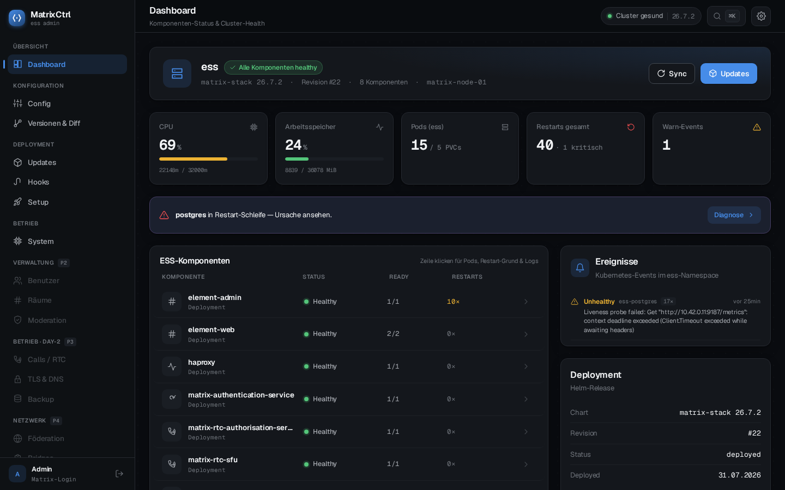
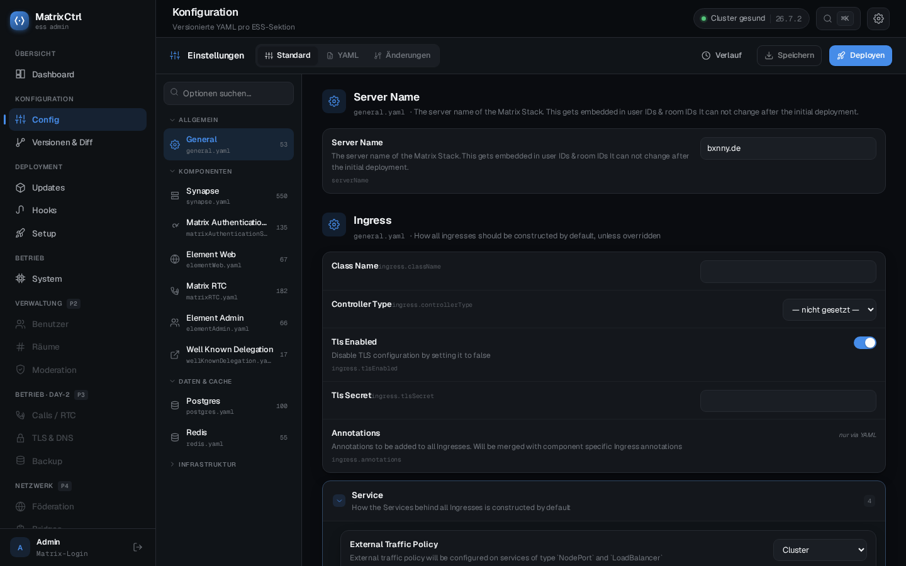
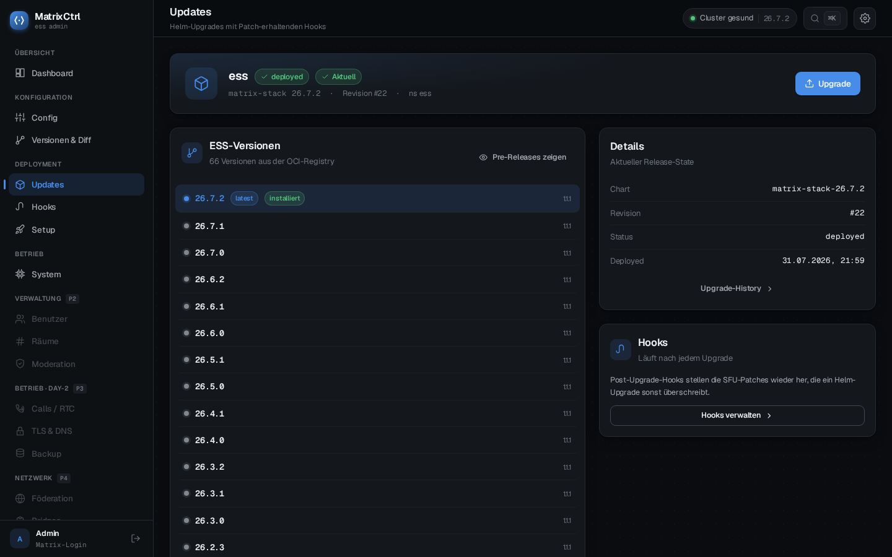
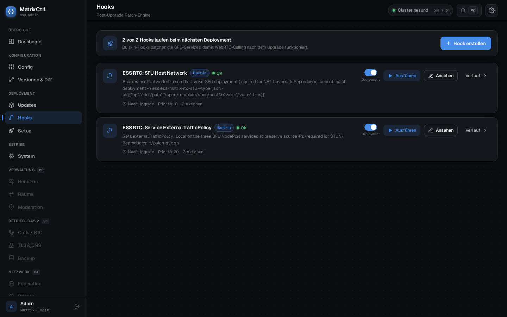
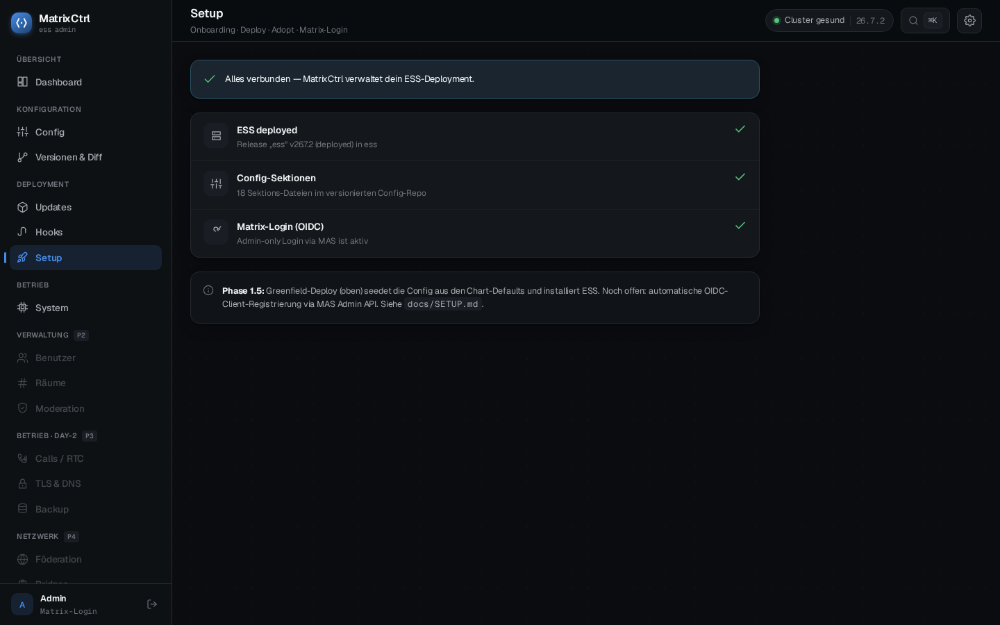
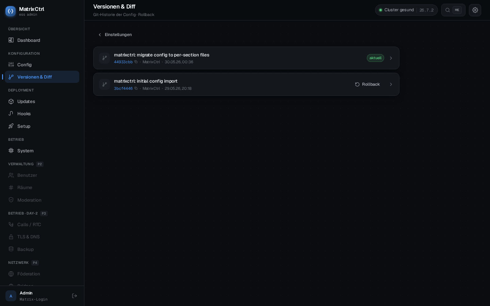
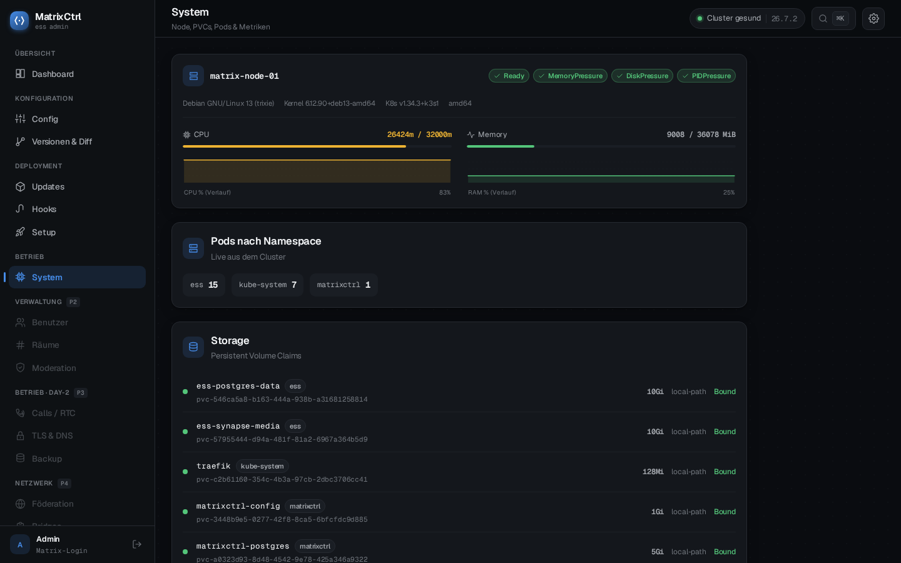

# MatrixCtrl

**An open-source admin layer for self-hosted Matrix / Element Server Suite (ESS) deployments.**

> *What UniFi is for networks, MatrixCtrl wants to be for Matrix.*

MatrixCtrl gives ESS Community a real Day-2 admin UI: edit config with validation
and versioning, run Helm upgrades that don't lose your manual patches, deploy a
fresh ESS, and manage it all behind admin-only Matrix login — without `vim`-ing
5,000-line YAML files or hand-patching MAS.

[](LICENSE)
`Go 1.26 · React 18 · Helm SDK · client-go · PostgreSQL`

> ### Read this before you install it
>
> **This is early software with one maintainer.** First published release:
> 2026-08-01. It runs one production homeserver — the author's.
>
> - **The interface is German only.** Docs, code and issues are English; an
>   English UI is [Phase 6](docs/ROADMAP.md). The screenshots below show exactly
>   what you would get.
> - **Deploying a fresh ESS was broken until 2026-08-01** and nobody noticed,
>   because the only instance running MatrixCtrl already had ESS and could never
>   reach that code path. It is now [proven end to end on an empty
>   cluster](docs/plans/etappe-15-greenfield-first-half.md) — but that is one
>   verified run, not a track record.
> - **One step is still untested:** connecting Matrix login on a brand-new
>   install needs public DNS to verify, which has not happened yet.
>
> [BACKLOG.md](docs/BACKLOG.md) is an honest, unflattering state of the project.
> Read it before you point this at a homeserver you care about.

---

## What it looks like



*Dashboard: every ESS component with its health and restart count, node metrics,
and — here — a Postgres restart loop, surfaced with a link to the cause.*

<details>
<summary><b>More screens</b> — config editor, upgrades, hooks, setup</summary>

**Config** — every ESS section as its own file. The help text under each field is
pulled from the chart's own `##` comments, so it cannot drift from the chart.



**Updates** — versions discovered from the OCI registry, with the deployed one
marked. Upgrading streams Helm's log live.



**Hooks** — the reason upgrades don't break calling: patches re-applied after
every Helm run, each one saying which manual `kubectl patch` it replaces.



**Setup** — onboarding state: is ESS deployed, is the config seeded, is Matrix
login connected.



**Versions & diff** — the config repo's git history, with rollback.



**System** — node conditions, CPU/RAM, pods per namespace and every PVC.



</details>

---

## Why

Self-hosting ESS today is a YAML desert:

- Helm values are edited by hand, with no validation beyond a pod crash.
- Every `helm upgrade ess` overwrites manual `kubectl patch`es (hostNetwork,
  `externalTrafficPolicy`, …) and WebRTC calling breaks until you re-apply them.
- No config history, no audit, no UI for routine operations.

MatrixCtrl fixes the config + Helm story first (the part nobody else builds), then
grows into full admin parity.

## Features

- **Config management** — every ESS section as its own versioned YAML file, edited
  either as a **Standard** form (schema-driven, with help text pulled from the
  chart's `##` comments) or as raw **YAML** (Monaco editor). Edits preserve
  comments. Backed by a git repo: diff, history, rollback.
- **Helm upgrades** — pick an ESS version, see live logs, and **post-upgrade hooks**
  re-apply the SFU patches automatically so calling never breaks.
- **Config → Deploy** — apply config changes to the cluster with one click.
- **Greenfield deploy & adopt** — deploy a fresh ESS from the chart defaults, or
  adopt an existing release (auto-discovered across namespaces).
- **Admin-only login via MAS (OIDC)** — verified through the MAS Admin API. Starts
  in local bootstrap mode and connects Matrix login in one click (registers its own
  MAS client — no manual policy patching).
- **Self-configuring** — DB password and JWT key are auto-generated.

## Quick start

### Prerequisites
- A Kubernetes cluster (k3s works great) with an ingress controller (Traefik).
- An existing ESS (`matrix-stack`) release, *or* let MatrixCtrl deploy one.
- **Architecture:** every release up to and including `0.1.61` publishes `linux/amd64`
  only — on an ARM board the image will not pull, which the README did not previously
  say. From `0.1.62` the release also builds `linux/arm64`; until a tagged release has
  actually produced one, treat arm64 as untested rather than supported.

<details>
<summary><b>Starting from a bare Debian/Ubuntu server?</b> — k3s + Helm in three commands</summary>

Skip this if you already have a cluster and `helm` on your PATH.

```bash
# 1. k3s — a single-node Kubernetes. Ships Traefik as the ingress controller,
#    so the prerequisite above is covered by this one command.
curl -sfL https://get.k3s.io | sh -

# 2. Point kubectl/helm at it. k3s writes its kubeconfig root-only, so either
#    run the following as root, or copy the file and chown it to your user.
export KUBECONFIG=/etc/rancher/k3s/k3s.yaml

# 3. Helm 3
curl -fsSL https://raw.githubusercontent.com/helm/helm/main/scripts/get-helm-3 | bash
```

Check it worked — the node should report `Ready`:

```bash
kubectl get nodes
helm version
```

**One more thing if you want HTTPS.** The install command below passes
`ingress.certIssuer=letsencrypt-prod`, which assumes [cert-manager](https://cert-manager.io/docs/installation/)
and a `ClusterIssuer` of that name already exist. Install cert-manager first, or
drop the `--set ingress.certIssuer=…` flag and terminate TLS however you prefer.

Both installer scripts above are piped straight from the internet into a shell.
That is what the upstream projects document, but read them first if that is not
acceptable in your environment.
</details>

### Install (recommended) — OCI chart

The chart and image are published to GHCR, so one command is all you need:

```bash
helm install matrixctrl oci://ghcr.io/bxnnyg/charts/matrixctrl \
  --namespace matrixctrl --create-namespace \
  --set ingress.host=matrixctrl.example.com \
  --set ingress.certIssuer=letsencrypt-prod
```

No version is pinned here on purpose: Helm resolves the newest published chart, so
this command cannot go stale. Each released chart pins its own matching image, so
"newest chart" still means one exact, reproducible pair — not a moving `latest`.

To install a specific release instead, add `--version <x.y.z>`; the available
versions are on the [releases page](https://github.com/bxnnyg/matrixctrl/releases).

The image is pulled from `ghcr.io/bxnnyg/matrixctrl`. Secrets (DB password, JWT key)
auto-generate on first install — nothing to set.

> Note: `helm install` can't read a GitHub URL — `github.com/bxnnyg/matrixctrl` is the
> source repo. Use the OCI chart above, or a local path / image import below.

<details>
<summary><b>Alternative — from a clone (local chart path)</b></summary>

```bash
git clone https://github.com/bxnnyg/matrixctrl
cd matrixctrl
helm install matrixctrl ./deploy/helm/matrixctrl \
  -n matrixctrl --create-namespace --set ingress.host=matrixctrl.example.com
```
</details>

<details>
<summary><b>Alternative — single-node k3s without pulling from a registry</b></summary>

Build and import the image straight into k3s containerd:

```bash
make docker            # or: docker build -t ghcr.io/bxnnyg/matrixctrl:dev .
docker save ghcr.io/bxnnyg/matrixctrl:dev | sudo k3s ctr images import -
helm install matrixctrl oci://ghcr.io/bxnnyg/charts/matrixctrl \
  -n matrixctrl --create-namespace \
  --set image.tag=dev --set image.pullPolicy=IfNotPresent \
  --set ingress.host=matrixctrl.example.com
```
</details>

## First run

1. Open `https://matrixctrl.example.com` and log in as **`admin`**. The password is
   generated on first start and written to the pod log:

   ```bash
   kubectl logs -n matrixctrl deploy/matrixctrl -c matrixctrl | grep "bootstrap admin password"
   # MatrixCtrl: bootstrap admin password: <generated>
   ```

   > **It is logged exactly once**, on the start where the admin user is created.
   > If the pod has restarted since, that line is gone from the current log — try
   > `kubectl logs -n matrixctrl deploy/matrixctrl -c matrixctrl --previous`, and see
   > [Lost the admin password?](#lost-the-admin-password) if it is no longer there.

   To choose the password yourself instead, set it at install time — then nothing is
   ever logged:

   ```bash
   helm install matrixctrl … --set secrets.adminPassword='your-password'
   ```
2. Go to **Setup**. MatrixCtrl auto-discovers your ESS:
   - **No ESS yet?** → *Deploy ESS* (pick a version + server name).
   - **ESS already running?** → *Adopt existing ESS* (seeds config from the release).
3. Click **Connect Matrix Login** → MatrixCtrl registers its own MAS OIDC client,
   upgrades ESS so MAS picks it up, and switches to admin-only Matrix login.

## Operating it

### DNS — the one record you need

MatrixCtrl needs a single hostname, whatever you passed as `ingress.host`:

| Type | Name | Value |
|------|------|-------|
| `A` (or `AAAA`) | `matrixctrl.example.com` | the public IP of the node running Traefik |

A `CNAME` to an existing name works too. If you let MatrixCtrl deploy ESS, that
wizard needs its own records (`matrix.`, `element.`, `mas.`, …) — it tells you
which ones.

> With `certIssuer` set, cert-manager only issues a certificate **after** the
> record resolves publicly, because the HTTP-01 challenge has to reach the
> cluster. If the page stays untrusted, check DNS first:
> `kubectl describe certificate matrixctrl-tls -n matrixctrl`.

### Ports

You do not publish a port yourself — Traefik terminates 80/443 and routes the
hostname to the service. Internally the container listens on **8080** and the
service exposes **80**; Postgres runs on 5432 inside the pod and is never exposed.

To reach the UI without DNS or an ingress (useful for a first look or when
something is broken):

```bash
kubectl port-forward -n matrixctrl svc/matrixctrl 8080:80
# → http://localhost:8080
```

### Logs

```bash
# Follow the app log (the pod also runs a postgres sidecar, hence -c).
kubectl logs -n matrixctrl deploy/matrixctrl -c matrixctrl -f

# The previous container, after a crash or restart.
kubectl logs -n matrixctrl deploy/matrixctrl -c matrixctrl --previous

# The database sidecar.
kubectl logs -n matrixctrl deploy/matrixctrl -c postgres
```

### Lost the admin password?

`secrets.adminPassword` is only read when the admin user is **created**, so setting
it afterwards changes nothing — the account already exists. To get a new one, delete
the stored credential and let the next start regenerate it:

```bash
kubectl exec -n matrixctrl deploy/matrixctrl -c postgres -- \
  psql -U matrixctrl -d matrixctrl -c "DELETE FROM bootstrap_credentials WHERE user_id='admin';"

kubectl rollout restart deploy/matrixctrl -n matrixctrl
kubectl logs -n matrixctrl deploy/matrixctrl -c matrixctrl | grep "bootstrap admin password"
```

This only affects the local bootstrap login. It does not touch your Matrix account,
and once you have switched to **Connect Matrix Login** you sign in via Matrix
anyway — the bootstrap admin is just the way in before OIDC exists.

### Stop, start, restart

```bash
# Stop it — the container goes away, all data stays.
kubectl scale deploy/matrixctrl -n matrixctrl --replicas=0

# Start it again.
kubectl scale deploy/matrixctrl -n matrixctrl --replicas=1

# Restart (e.g. after changing a secret by hand).
kubectl rollout restart deploy/matrixctrl -n matrixctrl
```

**Stopping MatrixCtrl does not touch your Matrix server.** ESS is a separate Helm
release and keeps running exactly as it is — you just lose the admin UI until you
scale it back up.

### Uninstall

```bash
helm uninstall matrixctrl -n matrixctrl
```

This deliberately **leaves three things behind**, so that reinstalling does not
lose your data or lock you out:

| Kept | Why |
|---|---|
| `pvc/matrixctrl-config` | the git config repo — every version and rollback point |
| `pvc/matrixctrl-postgres` | audit log, hooks, upgrade history |
| `secret/matrixctrl-secret` | DB password and JWT key — regenerating them invalidates every session |

They carry `helm.sh/resource-policy: keep`. To remove everything for real:

```bash
kubectl delete pvc matrixctrl-config matrixctrl-postgres -n matrixctrl
kubectl delete secret matrixctrl-secret -n matrixctrl
kubectl delete namespace matrixctrl
```

**Again: none of this removes ESS.** Your homeserver, its database and its media
are in the `ess` release and namespace and are untouched. What you lose is
MatrixCtrl's own history — the config repo's past versions and the audit trail.
The configuration your ESS is *currently running* lives in the ESS Helm release
and survives regardless.

To remove ESS as well — only if you really mean it — that is a separate,
destructive step: `helm uninstall ess -n ess`, which takes your homeserver with it.

## Using it

Installing is above; the three things that make this more than a dashboard —
**hooks** (patches that survive `helm upgrade`), the **config editor** (ESS values as
sections, comments intact), and **recovering a failed upgrade** — are explained in
[`docs/GUIDE.md`](docs/GUIDE.md).

## Configuration (Helm values)

| Key | Default | Notes |
|-----|---------|-------|
| `image.repository` / `image.tag` | `ghcr.io/bxnnyg/matrixctrl` / `latest` | |
| `ingress.host` | `matrixctrl.example.com` | your hostname |
| `ingress.certIssuer` | `""` | cert-manager ClusterIssuer, or empty if TLS is external |
| `ess.namespace` / `ess.release` | `ess` / `ess` | auto-discovered if not found |
| `secrets.dbPassword` / `secrets.jwtSecret` | `""` | empty = auto-generate |
| `oidc.*` | disabled | leave empty; wire via Setup → Connect Matrix Login |

## Architecture

```
Go backend (chi) + embedded React frontend, single container + Postgres sidecar.
  internal/config  — per-section YAML, comment-preserving edits, git versioning
  internal/helm    — helm.sh/helm/v3 SDK (no exec("helm")); install/upgrade/discover
  internal/hooks   — post-upgrade patch engine via client-go (no exec("kubectl"))
  internal/auth    — bootstrap (bcrypt+JWT) + OIDC via MAS, runtime hot-reload
```

## Development

```bash
make web-build      # build the React frontend
make build          # embed frontend + build the Go binary
make test           # unit tests
make dev            # run against a local Postgres (docker compose)
```

Go 1.26, Node 20.

<details>
<summary><b>Regenerating the screenshots</b></summary>

`docs/img/*.png` are produced by the same script CI uses to prove every route
renders — never taken by hand:

```bash
cd web
MATRIXCTRL_TOKEN=<jwt> node scripts/verify-ui.mjs \
  --base https://matrixctrl.example.com \
  --out ../docs/img \
  --redact my-node-name=matrix-node-01
```

`--redact from=to` rewrites visible text in the DOM immediately before each
screenshot, and reports how many text nodes it changed. The only instance with
real data is a production cluster whose node name must never reach a public
repository ([DESIGN §4.14](docs/DESIGN.md)), so the replacement is part of the
capture rather than a cleanup step someone forgets. **Look at every image before
committing it** — the flag protects against the string you thought of.

</details>

| Document | What it answers |
|---|---|
| [`docs/GUIDE.md`](docs/GUIDE.md) | **Using it** — hooks, the config editor, and recovering a failed upgrade |
| [`docs/VISION.md`](docs/VISION.md) | Where this is going, and what it deliberately won't do |
| [`docs/DESIGN.md`](docs/DESIGN.md) | What already exists — systems, gaps, dated decisions |
| [`docs/PROZESS.md`](docs/PROZESS.md) | How changes are planned, verified and shipped |
| [`docs/ROADMAP.md`](docs/ROADMAP.md) | Phases, the etappe log, and operations notes |
| [`docs/BACKLOG.md`](docs/BACKLOG.md) | What's worth doing next, and an honest state of the project |
| [`CHANGELOG.md`](CHANGELOG.md) | What changed in each version |
| [`docs/SETUP.md`](docs/SETUP.md) | The onboarding/bootstrap design |
| [`CLAUDE.md`](CLAUDE.md) | Rules for AI agents working in this repo |

## License

[AGPL-3.0](LICENSE). MatrixCtrl is free software — if you run a modified version as
a network service, you must offer your users its source.
